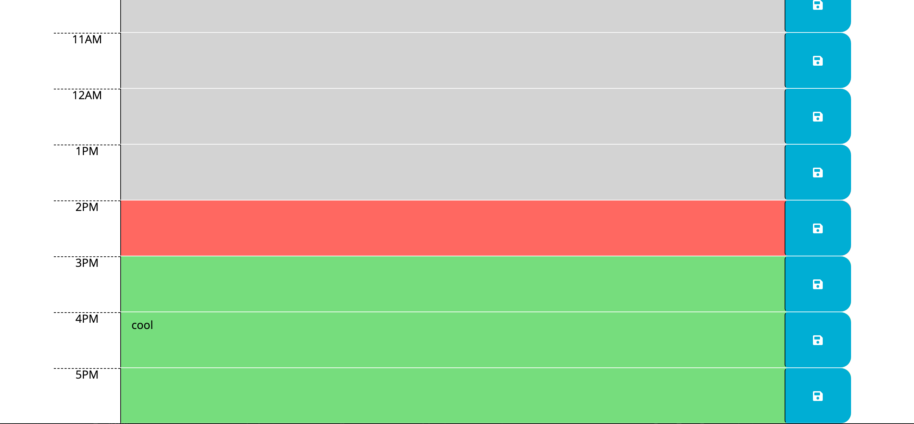
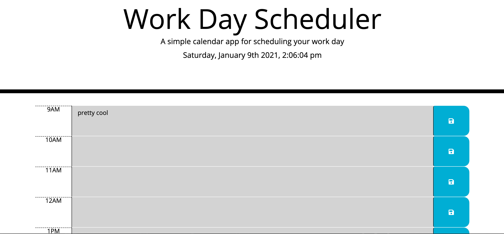

# WorkDay_Planner
  This workday planner is a simple web-site application at which a user can make scheduling notes and save them on the local browser.  
  
  The planner is presented in the format of a normal 9AM-5PM work day.  As the hours of the work day pass, the color of the hour blocks change dynamically based on wether the blocks are in the future (green), present (tomoato) or past (gray).  There is a running clock on the site as well that changes dynamically as well as full date month and time.  When a user wants to note something in the planner, they can simply type in the space between the time and the button and then press the button on the right with the save card on it to save the info to the local browser storage.
  
  
  
  
  Link to site: https://anthonyrspyker.github.io/WorkDay_Planner/.
  
  Content of Root Directory:
  - Readme file,
  - index.html
  - style.css
  - script.js
  
  Supporting API's used in this application:
  - JQuerry
  - FontAwsome
  - Moment.js
  
  Functions on This Site:
  - Dynamic date and clock calander.
  - Dynamically color coordinated time slots.
  - Local browser storage capabilities.
  

